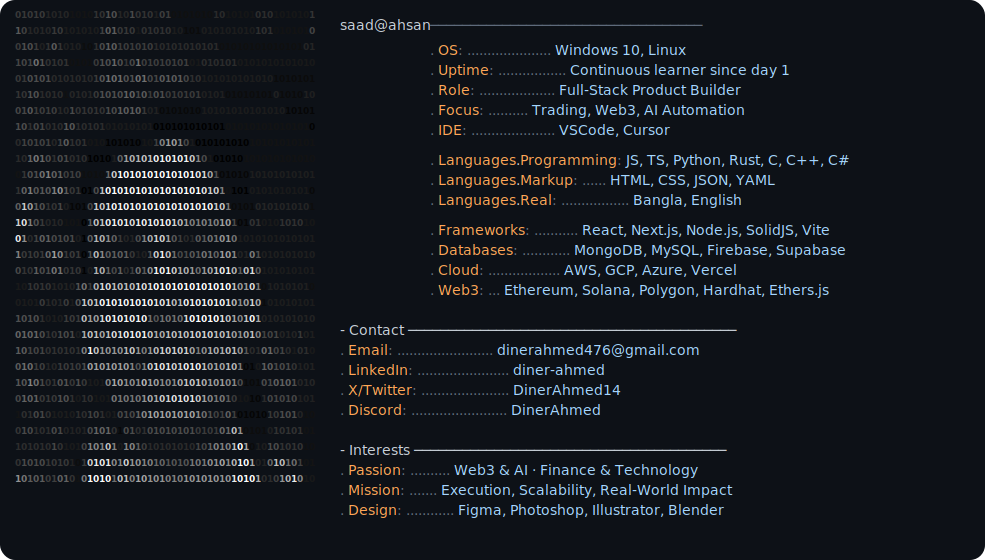

<a href="https://github.com/DinerAhmed10/DinerAhmed10">
  <picture>
    <source media="(prefers-color-scheme: dark)" srcset="dark_mode.svg">
    
  </picture>
</a>

## 🌐 Socials:
    

‎

## Tech Stack

<table width="100%">
  <tr>
    <td width="50%" valign="top">
      <h4>💻 Languages & Core</h4>
      
    </td>
    <td width="50%" valign="top">
      <h4>🚀 Frameworks & Tools</h4>
      
    </td>
  </tr>
  <tr>
    <td width="50%" valign="top">
      <h4>📊 Databases & Cloud</h4>
      
    </td>
    <td width="50%" valign="top">
      <h4>🎨 Design & Creative</h4>
      
    </td>
  </tr>
</table>

 

####  Web3 & Blockchain Infrastructure

&nbsp;
&nbsp;
&nbsp;
&nbsp;
&nbsp;
&nbsp;
&nbsp;
&nbsp;
&nbsp;
&nbsp;
&nbsp;
&nbsp;
&nbsp;
&nbsp;
&nbsp;
&nbsp;

 

---

‎
‎
‎
‎
‎
‎
# 📊 GitHub Stats:
 
 

---

<!-- Proudly created with GPRM ( https://gprm.itsvg.in ) -->
